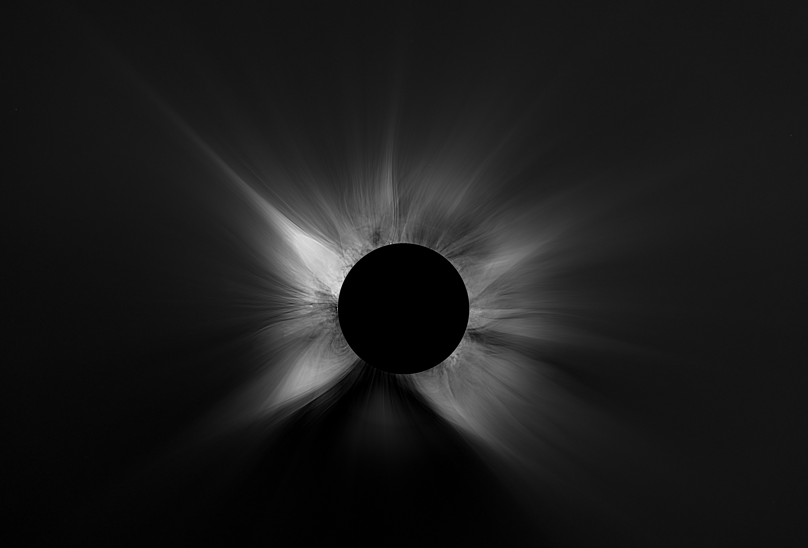

# My attempt to capture and process Solar eclipse images

<a href="results/fixed_0052_s1.0000-w12.0000_s2.0000-w6.9282_s4.0000-w4.0000_crop.png">
  
</a>

As a hobby project, I tried my first astrophotography: capturing and processing images of the total solar eclipse of August 12th, from Trigaza Norte o La Zapatera, Spain. I consider the result acceptable, but there's still huge room for improvement:

- The image is grayscale, while the actual thing was rich in fascinating colors.
- There is heavy postprocessing, which introduces some unpleasant artifacts (1px white ring around Moon, unnatural variations of corona brightness, variations of background brightness).
- My postprocessing gets confused by the brightest inner corona, so I had to extend the Moon's limb, sacrificing some beautiful protuberances.
- It doesn't model the effects of the atmosphere.

On the positive side, the postprocessing step that sharpens linear structures (the coronal streamers) works nicely — see `fft_unsharp_and_save` in [`v8/eclipse_v8/stage3.py`](v8/eclipse_v8/stage3.py), a sliding-patch FFT-smoothed unsharp mask.

## Running it

You'll need a CUDA-capable GPU. I successfully ran it on machine with 32GB RAM and NVIDIA RTX 3090 GPU.

1. Get the raw data: [`josefslavicek/e202602-eclipse-data2`](https://www.kaggle.com/datasets/josefslavicek/e202602-eclipse-data2) on Kaggle.
2. Set up the environment from [`environment.yml`](environment.yml):
   ```
   conda env create -f environment.yml
   conda activate e202602_eclipse
   ```
3. Run the pipeline (swap in your own data path):
   ```
   CUDA_DEVICE_ORDER=PCI_BUS_ID CUDA_VISIBLE_DEVICES=1 python v8/pipeline.py \
       --nef-dir /home/slavik/e202602_eclipse/my_raws \
       --workdir /home/slavik/tmp/eclipse_v8_rtx3090
   ```
